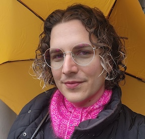

<figure class="author-image">

</figure>

Kaia Peacock is a writer, singer, and community organizer based in the San Francisco Bay Area. She is passionate about creating spaces for personal growth, healing, and connection through the arts and spirituality. Kaia grew up in the Evangelical Christian tradition, migrated to the Episcopal faith in college, and has since turned to pagan practices as a way to connect with the divine and the natural world.
